# Application Monitoring

Application monitoring in IBM Cloud Pak for Multicloud Management provides various indicators like the below.

## 1. Execution Time and Memory Usage

The below image shows the Golden signals of an app in Kubernetes Serivce.

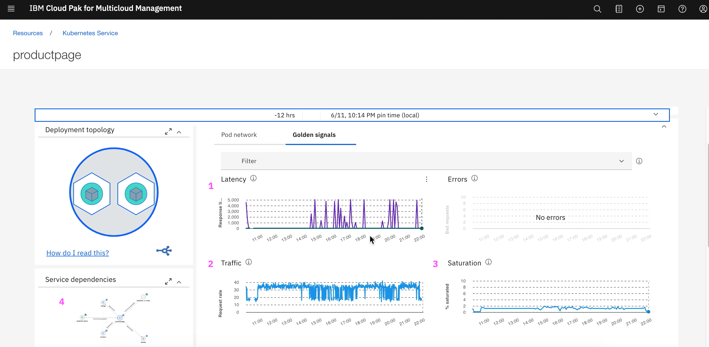

1. Latency (Execution Time)
2. Traffic (No. of Requests)
3. Saturation (Memory usage)

### Latency (Execution Time)

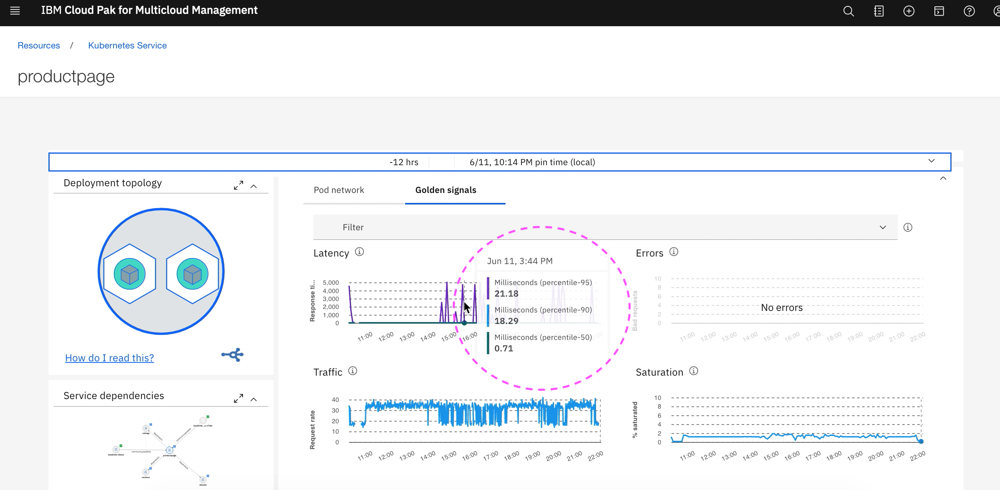

### Traffic (No. of Requests)

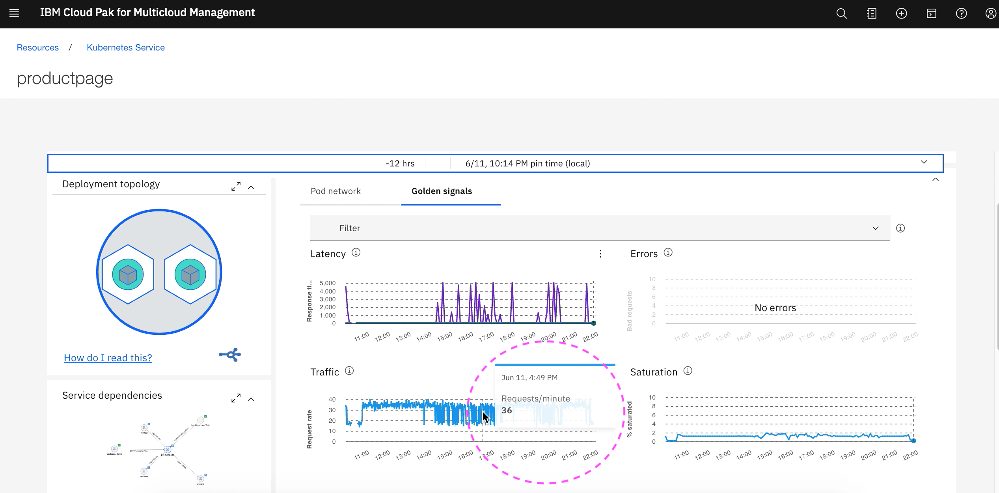

### Saturation (Memory usage)

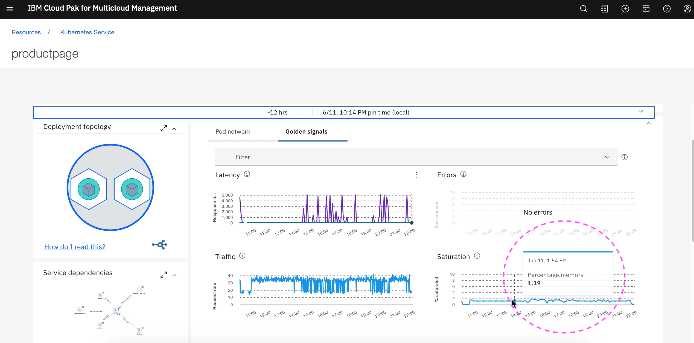

## 2. Tracing / transaction tracking

Here is the list of APIs called in this app.

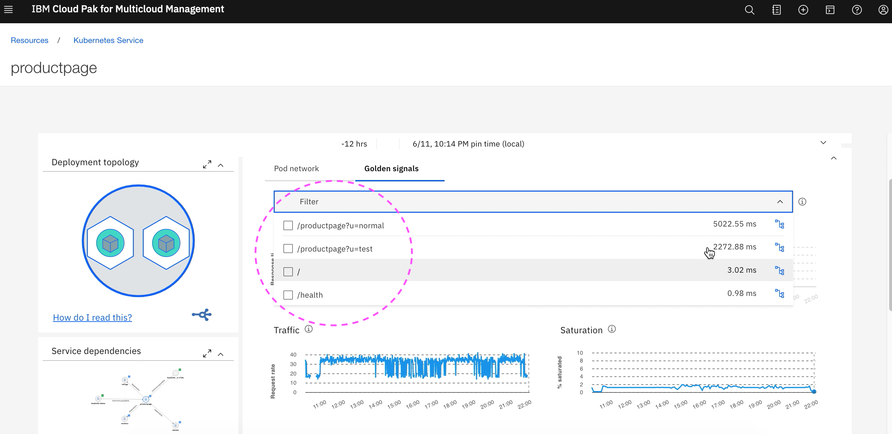

You can choose the any of the API and find the tracing details as like the below images.

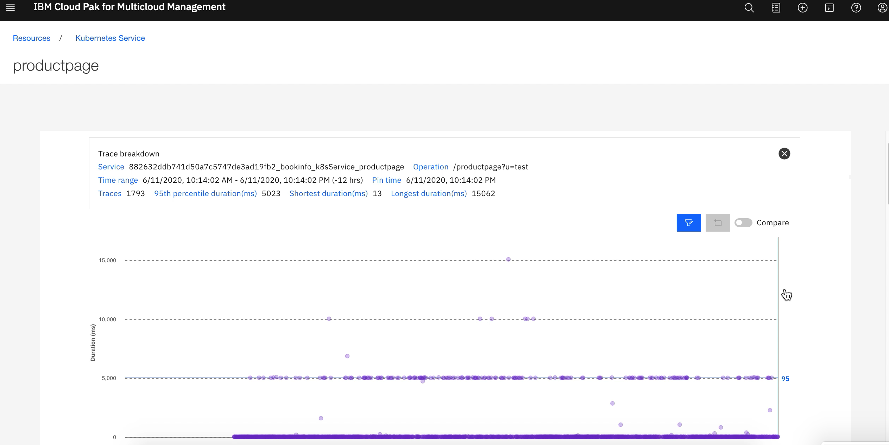
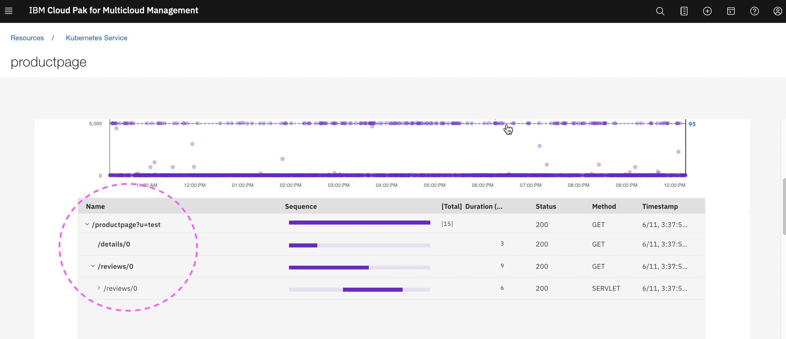
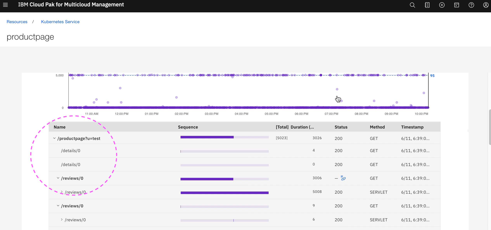

The detailed explnation from the knowledge center is available at https://www.ibm.com/support/knowledgecenter/SSFC4F_1.3.0/icam/monitor_tt.html

## 3. CPU and Memory usage

CPU and Memory usage can be seen more detailed at the Kubernetes POD level.

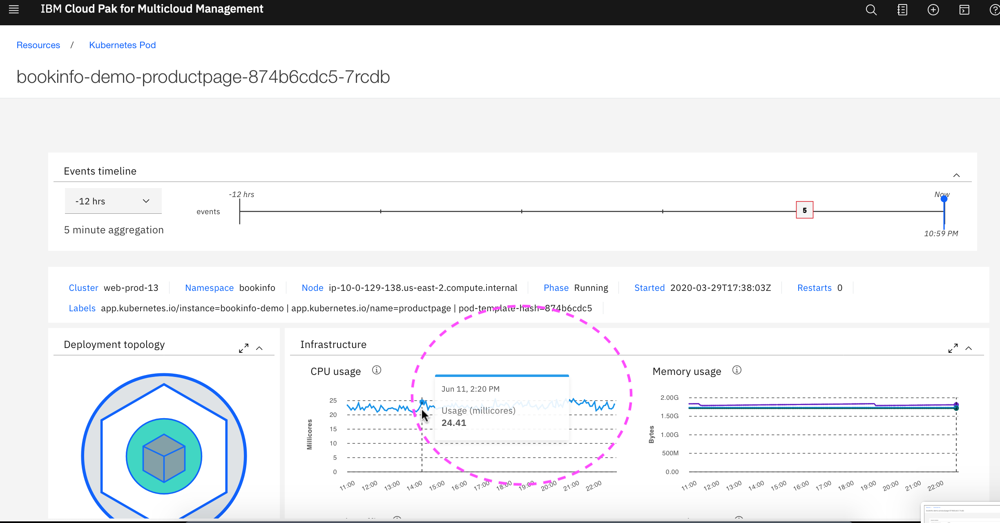

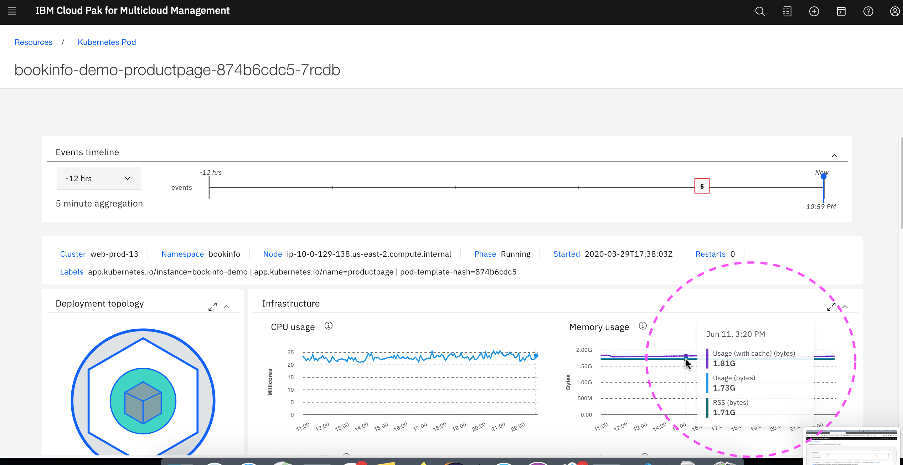

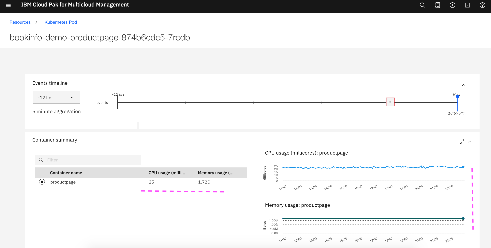

## 4. Thread usage

Thread usage can be seen for the springboot applications at J2SE Application Runtime.

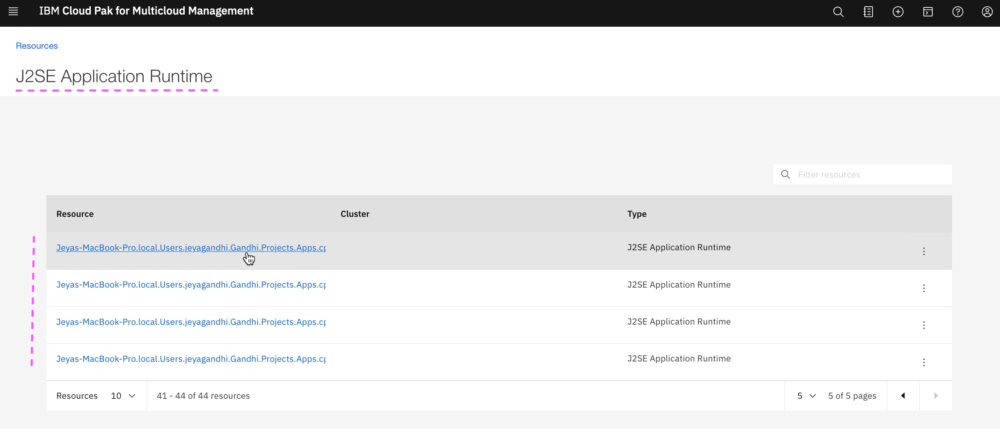

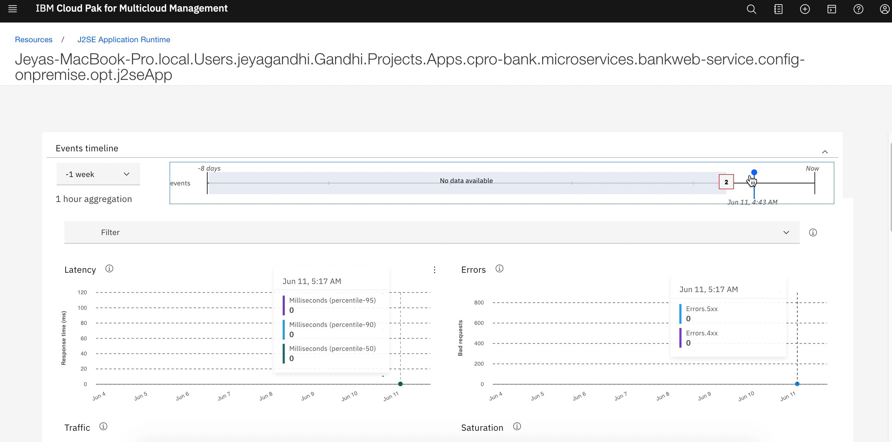

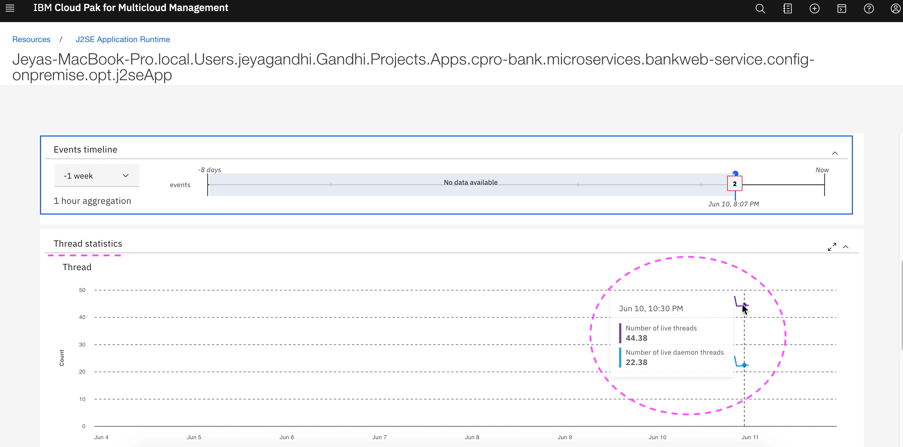

## References

For further references read the IBM knowledge center.

Transaction tracking
https://www.ibm.com/support/knowledgecenter/SSFC4F_1.3.0/icam/monitor_tt.html

Incident Resolution Flow for a Kubernetes App
https://www.ibm.com/support/knowledgecenter/SSFC4F_1.3.0/icam/overview_ui_start6.html