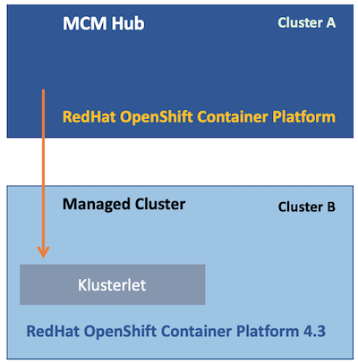
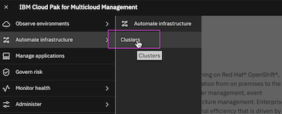
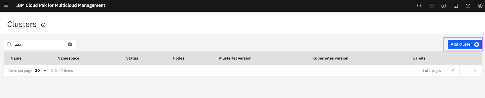
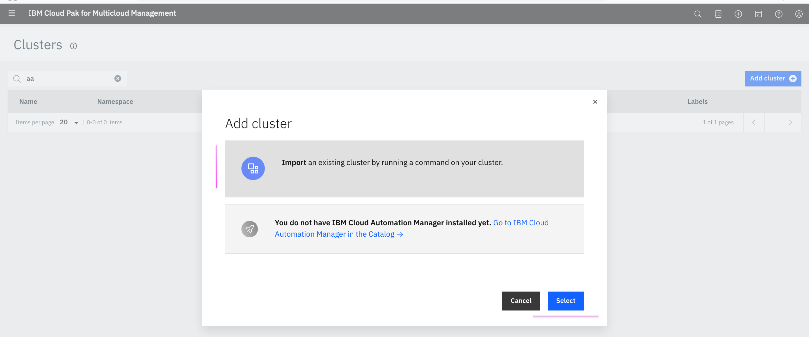
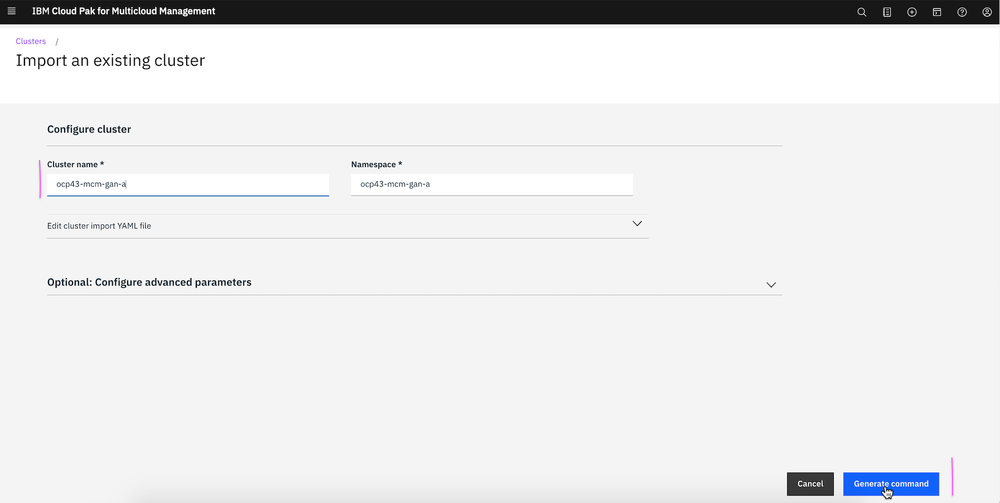
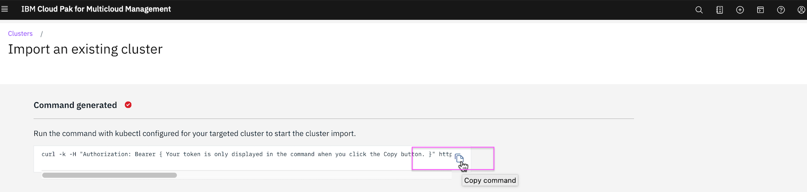
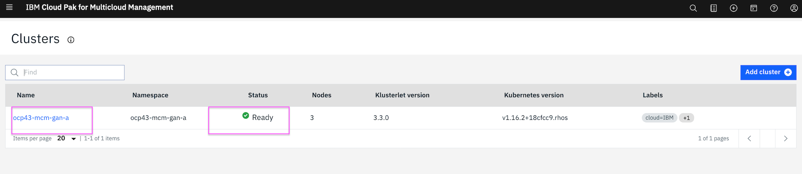

# Importing Managed Cluster 

In this documentation, lets see how to import a Cluster into Multicloud Management hub cluster as an **account administrator**. 

A Kubernetes cluster B is imported into IBM Cloud Pak® for Multicloud Management hub cluster A and it become a managed cluster for the hub cluster.




IBM Knowledge center document contains the detailed explanation about the same. This documentation is a snapshot of it.
https://www.ibm.com/support/knowledgecenter/SSFC4F_1.3.0/mcm/manage_cluster/import_gui.html#import

This documentation is based on the below environment.
- MCM Hub : MCM Version 1.3.2
- Managed Cluster : Redhat OpenShift Container Platform 4.3

---------

## 1. Create Namespace in Hub Cluster

#### 1. Log in to the hub cluster

Loginin into hub cluster as an **account administrator**.

Note: It is a account administrator not a cluster administrator.

```
cloudctl login -a <cluster URL> -u <account-admin-username> -p <account-admin-password> --skip-ssl-validation -c <account ID or name> -n <namespace>
```

ex:
```
cloudctl login -a https://icp-console.ocp43-mcm-132-gan-7ec.us-east.containers.appdomain.cloud -u mcmaccadmin -n default --skip-ssl-validation
```

#### 2. Create Namespace

Run the below command to creat a namespace. It is good to use clustername for namespace.

```
oc create namespace <namespace-name>
```

ex:
```
oc create namespace ocp43-mcm-gan-a
```

#### 3. Get the `account id` for your `account name`

Get the `account id` for your `account name` by running the below command.

```
cloudctl iam accounts
```

The output may be the following. 
```
ID                     Name   
2a82-45f9              demo-account   
id-mycluster-account   mycluster Account  
```
The account id for the account  `demo-account` is `2a82-45f9`

#### 4. Find the `account id` annotated in the namespace.

Find the `account id` annotated in the namespace by running the below command.

```
oc get namespace <namespace-name> -o yaml
```

ex:

```
oc get namespace ocp43-mcm-gan-a -o yaml
```

The output may be the following. 
```
apiVersion: v1
kind: Namespace
metadata:
  annotations:
    mcm.ibm.com/accountID: sadfd-dsfs
    mcm.ibm.com/type: System
    openshift.io/sa.scc.mcs: s0:c30,c5
    openshift.io/sa.scc.supplemental-groups: 1000880000/10000
    openshift.io/sa.scc.uid-range: 1000880000/10000
  name: ocp43-mcm-gan-a
spec:
  finalizers:
  - kubernetes
status:
  phase: Active
```

We observe that, the value of `mcm.ibm.com/accountID` is not equivalent to the `account id` `2a82-45f9` that we found above.


#### 5. Patch the right `account id` in the namespace.

Replace the << NAMESAPCE>> and <<ACCOUNT_ID>> appropriately and run the below command.

```
kubectl annotate --overwrite namespace <<NAMESAPCE>> mcm.ibm.com/accountID='<<ACCOUNT_ID>>'
```

ex:
```
kubectl annotate --overwrite namespace ocp43-mcm-gan-a mcm.ibm.com/accountID='2a82-45f9'
```

---------

## 2. Import Cluster in Hub Console.

1. In the MCM Hub console, from the navigation menu, click `Automate infrastructure > Clusters`.



2. Click `Add Cluster`.



3. Select `Import an existing cluster by running a command on your cluster`. Then, click `Select` button.



4. Enter unique values for the `Cluster name` and `Namespace` fields. Then, click `Generate Command` button.



5. Click on `Copy Command icon` to copy the commands to run in the targetted managed cluster.



---------

## 3. Run the Import command in Managed Cluster

1. Open the commandline window and login to the targetted managed cluster with `oc login` command.

2. Run the above copied command by pasting it in the command line window.

3. Few objects would get created. An error would occur. Try running the same command again. Now it should work.

---------

## 4. View the imported cluster.

1. In the MCM Hub console, from the navigation menu, click `Automate infrastructure > Clusters`.


2. See the imported cluster.



   The cluster is imported into hub cluster and become a managed cluster.

---------