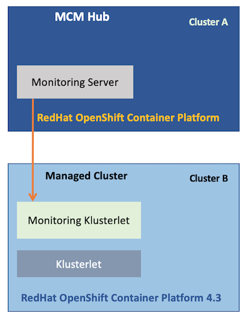
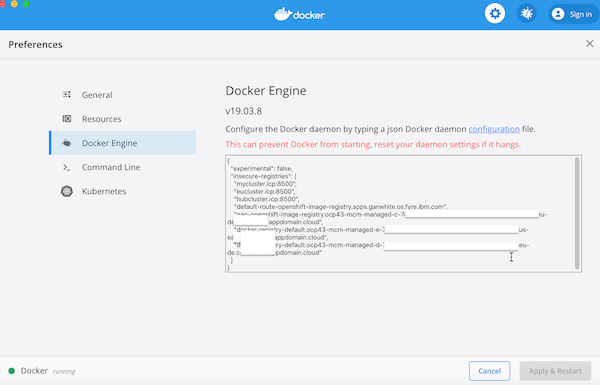

# Installing Monitoring klusterlet on a managed cluster

A Kubernetes cluster B is imported into IBM Cloud Pak® for Multicloud Management hub cluster A and it become a managed cluster for the hub cluster.

The Hub Cluster A, monitors the Kubernetes resources and events of the managed kubernetes cluster B. To enable this monitoring managed cluster B, should have Monitoring klusterlet installed.




In this documentation, lets see how to install Monitoring klusterlet on a managed cluster.

IBM Knowledge center document contains the detailed explanation about the same. This documentation is a snapshot of it.
https://www.ibm.com/support/knowledgecenter/en/SSFC4F_1.3.0/icam/install_mcm_klusterlet_no_helm.html

This documentation is based on the below environment.
- MCM Hub : MCM Version 1.3.0
- Managed Cluster : Redhat OpenShift Container Platform 4.3


## 1. Download Monitoring klusterlet packages from Passport Advantage

1. Locate the Monitoring klusterlet packages on [Passport Advantage](https://www.ibm.com/software/passportadvantage/). 

2. Find the installation image by searching for it using its part number. For the list of part numbers, see [Passport Advantage part numbers](https://www.ibm.com/support/knowledgecenter/SSFC4F_1.3.0/about/part_numbers.html).

I have choosen the below according to my need.

`Multicluster Event Management Klusterlet on AMD64` 	`agent_ppa_2020.1.0_prod_amd64.tar.gz` 	`CC5WSEN`

3. Download the file to some folder in your local system.


## 2. Extract the downloaded packages

1. Create a new directory in your local system.

```
mkdir images
```

2.  Extract the Docker images from the above downloaded package by running the below command.

```
tar xvf agent_ppa_2020.1.0_prod_amd64.tar.gz images/
```

The `images` directory contains the following images:

```
images/agentoperator_APM_202003100816.tar.gz
images/k8-monitor_APM_202003092352.tar.gz
images/k8sdc-operator_APM_202003092352.tar.gz
images/reloader_202002170811-multi-arch.tar.gz
```

## 3. Upload the images to Openshift Container Registry

The Openshift container image registry should have been exposed via route. If not refer [Exposing Openshift container registry](#Exposing-Openshift-container-registry) section.

#### 1. Find hostname of image registry

1. Find the hostname of the image registry by running the below command.

```
oc get routes -n openshift-image-registry
```

The output could be like this.

```
NAME   HOST/PORT PATH   SERVICES         PORT       TERMINATION   WILDCARD
gan    docker-registry-default.ocp43-mcm-managed-d-7asdf-0000.xx-yy.containers.appdomain.cloud          image-registry   5000-tcp   passthrough   None
```

2. Take the `hostname` alone from the above output. the value is `docker-registry-default.ocp43-mcm-managed-d-7asdf-0000.xx-yy.containers.appdomain.cloud`.

#### 2. Login into image registry

1. Export the `hostname` by running the below command.

Syntax: 
```
export my_registry_name=<<hostname>
```

Example: 
```
export my_registry_name=docker-registry-default.ocp43-mcm-managed-d-7asdf-0000.xx-yy.containers.appdomain.cloud
```

2. Login into the docker container registry by running the below command.

```
docker login $my_registry_name -u $(oc whoami) -p $(oc whoami -t)
```

#### 3. Upload docker images

Upload the images by running the below commands.

```
docker load -i images/agentoperator_APM_202003100816.tar.gz
docker tag agentoperator:APM_202003100816 $my_registry_name/multicluster-endpoint/agentoperator:APM_202003100816  
docker push $my_registry_name/multicluster-endpoint/agentoperator:APM_202003100816
docker load -i images/k8-monitor_APM_202003092352.tar.gz
docker tag k8-monitor:APM_202003092352 $my_registry_name/multicluster-endpoint/k8-monitor:APM_202003092352  
docker push $my_registry_name/multicluster-endpoint/k8-monitor:APM_202003092352
docker load -i images/k8sdc-operator_APM_202003092352.tar.gz
docker tag k8sdc-operator:APM_202003092352 $my_registry_name/multicluster-endpoint/k8sdc-operator:APM_202003092352  
docker push $my_registry_name/multicluster-endpoint/k8sdc-operator:APM_202003092352
docker load -i images/reloader_202002170811-multi-arch.tar.gz
docker tag reloader:202002170811-multi-arch $my_registry_name/multicluster-endpoint/reloader:202002170811-multi-arch  
docker push $my_registry_name/multicluster-endpoint/reloader:202002170811-multi-arch
```

## 4. Create Service Account and Cluster Role Bindings

#### 1. Find dockercfg secret

1. Find the `dockercfg secret` of the image registry by running the below command.

```
oc get secret -n multicluster-endpoint | grep deployer-dockercfg
```

The output could be like this.

```
deployer-dockercfg-sssd2                             kubernetes.io/dockercfg               1      13d
```

2. Take the `dockercfg secret` from the above output. the value is `deployer-dockercfg-sssd2`.

#### 2. Create Service Account

1. Create `Service Account` by running the below command.

```
oc apply -f ./files/sa.yaml
```

2. Patch `Service Account` with `dockercfg secret` by running the below command.

Note: You have to Replace `deployer-dockercfg-sssd2` with your value from step 2.

```
kubectl patch serviceaccount icamklust -p '{"imagePullSecrets": [{"name": "deployer-dockercfg-sssd2"}]}' -n multicluster-endpoint
```

#### 3. Create ClusterRoleBinding

Create `ClusterRoleBinding` by running the below command.

```
oc create clusterrolebinding my-icamklust --clusterrole=cluster-admin --serviceaccount=multicluster-endpoint:icamklust -n multicluster-endpoint
oc create clusterrolebinding my-default --clusterrole=cluster-admin --serviceaccount=multicluster-endpoint:default -n multicluster-endpoint
```

## 5. Create MonitorKlusterlet Resources in Cluster

The below files contains the required resources.

```
./files/monitorklusterlet-1-crd.yaml
./files/monitorklusterlet-2-k8sdc-operator.yaml
./files/monitorklusterlet-3-icam-reloader.yaml
./files/monitorklusterlet-4-crd.yaml
```

#### 1. Replace image registry name.

Need to replace the image registry name in the files monitorklusterlet-2, 3 and 4.

1. Find the image registry name by running the below command.
```
oc registry info
```

The ouput could be
```
image-registry.openshift-image-registry.svc:5000
```

If the ouput is `image-registry.openshift-image-registry.svc:5000` then you can skip the next step.

2. Find the text `image-registry.openshift-image-registry.svc:5000` in the below files and replace with the text that you got in the above step.

```
./files/monitorklusterlet-2-k8sdc-operator.yaml
./files/monitorklusterlet-3-icam-reloader.yaml
./files/monitorklusterlet-4-crd.yaml
```

#### 2. Replacing imagePullSecrets

Find the text `ideployer-dockercfg-sssd2` in the below file and replace with the text that you got in the step 4.1 for `dockercfg secret`.

```
./files/monitorklusterlet-2-k8sdc-operator.yaml
```

#### 3. Deploy the resources

Run the below command to deploy the resources.

```
oc apply -f ./files/monitorklusterlet-1-crd.yaml
oc apply -f ./files/monitorklusterlet-2-k8sdc-operator.yaml
oc apply -f ./files/monitorklusterlet-3-icam-reloader.yaml
oc apply -f ./files/monitorklusterlet-4-crd.yaml
```

#### 4. Verify the deployment

Run the below commands to verify the installations are ok.

```
kubectl get deployment k8sdc-operator --namespace=multicluster-endpoint
kubectl get deployment icam-reloader --namespace=multicluster-endpoint
kubectl get deployment agentoperator --namespace=multicluster-endpoint
kubectl get deployment k8sdc-cr-k8monitor --namespace=multicluster-endpoint
```

## 6. Update MCM Hub for Monitoring.

When a managed cluster is imported, the namespace corresponding to the managed cluster is created at the hub cluster. 
To activate monitoring of the managed cluster resources, add the namespace as a resource to a Monitoring team. 

You can add the namespace by completing the following steps:

- In the navigation, select Manage > Identity and Access > Teams.
- Select the team that you want to update.
- Select Manage resources.
- Select the checkbox for namespace that you want to add to the team.
- Select Save to save your changes.

## Appendix

### Exposing Openshift container registry

Steps given here to expose the container registry in RHOCP 4.3

1. Run the below command to expose container registry through route

```
oc create route passthrough --service=image-registry -n openshift-image-registry
```

2. Run the below command to see the created routes

```
oc get routes -n openshift-image-registry
```

The output could be like this.

```
NAME   HOST/PORT PATH   SERVICES         PORT       TERMINATION   WILDCARD
gan    docker-registry-default.ocp43-mcm-managed-d-7asdf-0000.xx-yy.containers.appdomain.cloud          image-registry   5000-tcp   passthrough   None
```

3. Run the below command to verify the registry is accessible.

Here hostpath is taken form the above step.

```
curl -kv https://docker-registry-default.ocp43-mcm-managed-d-7asdf-0000.xx-yy.containers.appdomain.cloud
```

The output should have ResponseCode 200

4. Add the hostpath to insecure-registries.

For Mac add the hostpath to insecure-registries in the docker desktop as like below.



5. Try login into docker registry using the below command.

```
docker login docker-registry-default.ocp43-mcm-managed-d-7asdf-0000.xx-yy.containers.appdomain.cloud -u $(oc whoami) -p $(oc whoami -t)
```
