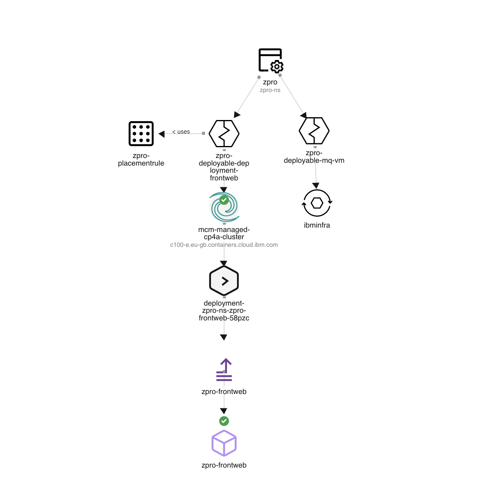

# Z-Pro application

An Hybrid Application with VM.

- MCM 2.0
- Hybrid Application.
- VM

## Installation

1. Change the PlacementRule cluster the text "name: mcm-managed-cp4a-cluster" appropriately in the yaml file.

2. Run the below command to deploy the app.

```
oc apply -f zpro.yaml
```

## Topology


